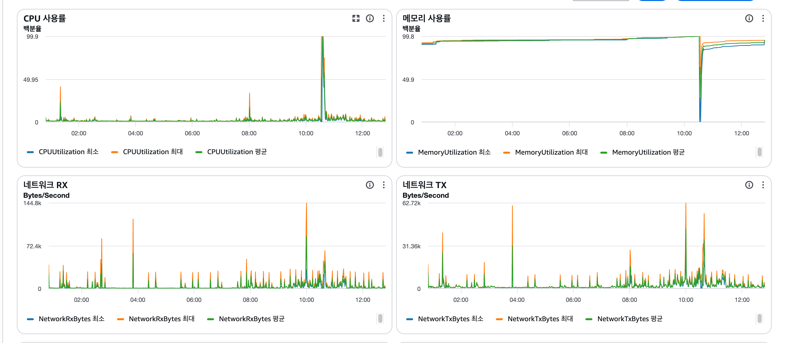
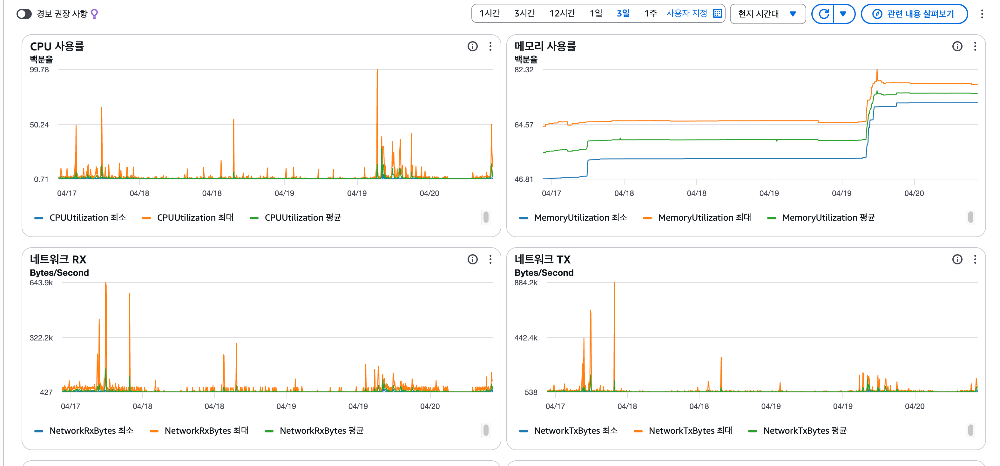
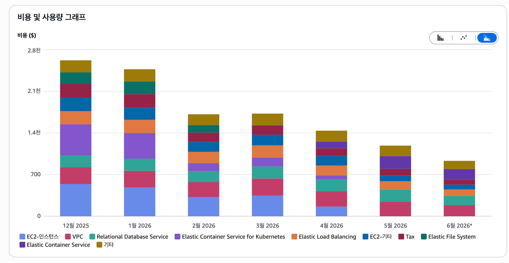
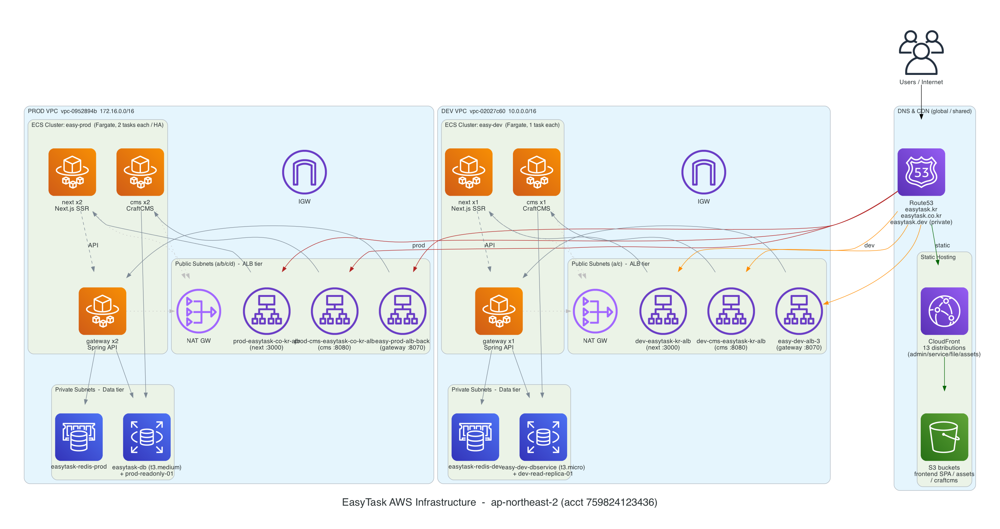

## 개요

모든 백엔드 인원이 퇴사하면서, 이제 혼자서 백엔드와 인프라를 함께 담당하게 되었습니다.
그래서 이 기회에 사내 인프라 운영 비용을 감축하기 위해 전체 구조를 점검했고, 그 결과 **운영 중이던 모든 서비스를 EKS에서 ECS Fargate로 전환**하기로 결정했습니다.

이번 글에서는 **팀 규모에 비해 과했던 EKS 기반 인프라를 ECS Fargate로 옮기고, 동시에 모든 인프라를 Terraform 코드로 정리한 과정**을 정리합니다.
특히 인프라 지식이 깊지 않은 상태에서 AI를 페어 엔지니어처럼 활용해, 한 명이 멀티 서비스 인프라 전환을 비교적 안전하게 수행한 경험을 함께 담았습니다.

> 왜 이전에는 못했는가?
> 개발팀에 인원이 있었을 때는 인프라를 축소하는 것에 부정적인 의견이 많았습니다. "잘 돌아가는 것을 굳이 왜 바꾸느냐", "런웨이가 얼마 남지 않았으니 일단 앞으로 나아가야 한다"는 의견이 있었고, 저를 제외한 대부분이 EKS -> ECS 전환에 부정적이었습니다. 결국 인원 구조가 바뀌고 나서야 이 작업을 추진할 수 있었습니다.

---

## 문제 상황: 팀 규모에 비해 과했던 오버 엔지니어링

가장 큰 문제는 **비용**이었습니다.

- 인프라 비용이 환율 1,400원 후반 기준 **월평균 약 300만 원** 발생
- 2025년 11월에는 최대 **USD 2,619(약 400만 원)** 까지 기록


회사 상황이 어려워지는 가운데, 인프라를 담당하는 입장에서 비용 정리는 반드시 필요한 과제였습니다.
EKS -> ECS 마이그레이션 이전에도 Jenkins -> Github Actions로 바꾸면서 인스턴스개수를 줄여가기 위해서 노력했지만
클러스터 비용이 만만치 않았고 구조적으로도 부담이 컸습니다. 

기존 EKS 환경은 트래픽과 무관하게 EC2 노드그룹이 항상 떠 있어 고정비가 발생했고, Kubernetes 버전 관리, 노드 운영, ArgoCD, AWS Load Balancer Controller 등 **팀 규모에 비해 관리해야 할 요소가 지나치게 많았습니다.** 게다가 서비스 실행에 필요한 설정과 의존성이 Kubernetes 리소스, 컨트롤러가 생성한 AWS 리소스, 애플리케이션 환경변수 등에 분산되어 있어 전체 구조를 한눈에 파악하기 어려웠습니다.
마침 AI가 충분히 발전했다고 판단했고, 인프라 지식이 깊지 않아도 함께 분석한다면 빠르고 안전하게 마이그레이션할 수 있을 것이라 기대했습니다.

---

## 해결 전략: 위험을 최소화하는 순서로 단계 쪼개기

인프라는 순서 하나만 잘못되어도 전체 서비스가 멈출 수 있습니다.
그래서 전체를 한 번에 바꾸지 않고, **위험을 최소화하는 순서**로 작업을 쪼개는 것을 가장 먼저 설계했습니다. 큰 원칙은 세 가지였습니다.

1. **dev 먼저, prod 나중** — dev에서 전 과정을 검증하고 그대로 prod에 복제
2. **인프라(공통) → 서비스(개별) 순서** — ECS 클러스터/IAM/SG 같은 공통 토대를 먼저 깔고, 그 위에 서비스를 하나씩 올림
3. **언제든 즉시 롤백 가능하게** — ALB 리스너 룰의 priority만 바꿔 EKS ↔ ECS 트래픽을 전환 (DNS/Route 53은 건드리지 않음)

이 원칙 아래에서 AI를 단순 코드 생성 도구가 아니라 페어 엔지니어처럼 활용했습니다. 설계 방향을 함께 검토하고, 로그와 증상을 같이 분석해 원인을 좁혀나갔습니다. 다만 **모든 변경은 `terraform plan`으로 먼저 검토하고 `apply` 여부는 직접 판단**했습니다. AI는 선택지와 가설을 빠르게 제시하는 역할을, 최종 검증과 의사결정은 제가 맡는 방식으로 속도와 안정성의 균형을 맞췄습니다.

---

## 사전 준비: 왜 IaC(Terraform)인가

EKS -> ECS로 옮기면서 IaC를 Terraform으로 관리하기로 했습니다. 이유는 명확했습니다.

- **형상 관리**: 코드로 관리하면 이전 상태로 롤백이 쉽고, PR과 커밋 내역으로 "무엇을, 왜 바꿨는지" 추적할 수 있습니다.
- **추적성**: AWS GUI로만 관리하면 어떤 작업을 했는지 나중에 찾기가 어렵습니다.
- **속도**: 우리가 모든 언어의 문법을 외우지 않아도 코드를 작성하듯, IaC도 큰 흐름만 이해하면 AI와 함께 빠르게 다룰 수 있습니다. GUI에서 하나씩 클릭하며 분석하는 것보다 코드로 다루는 편이 오히려 빨랐습니다.

Ansible 대신 Terraform을 선택한 이유는, **`terraform plan`으로 클라우드 리소스의 생성/삭제/변경을 사전에 구조적으로 예측**할 수 있다는 점이 인프라 전환 작업에서 가장 큰 안전장치였기 때문입니다.

---

## 세부 작업 순서

작업 순서를 그대로 Terraform 디렉토리 구조로 반영해, 각 단위를 독립적으로 apply하고 롤백할 수 있게 했습니다.

### 사전 준비

- Terraform state용 S3 버킷(`easy-terraform-state-...`)을 먼저 생성
- 모든 인프라를 Terraform 코드로 관리하기 위한 토대
- DynamoDB state locking은 사용하지 않기로 결정 — 1인 작업이라 불필요

### 1단계 — ECS 클러스터 인프라 (`cluster/`)

가장 먼저 깔아야 하는 **공통 토대**입니다.

- ECS 클러스터, Task Execution Role, Task Role, ECS Tasks용 Security Group, IAM
- **왜 먼저?** 모든 서비스(spring server, front, cms PHP server)가 `terraform_remote_state`로 cluster의 출력값(cluster_id, SG, Role ARN)을 참조합니다. → cluster를 먼저 apply해서 S3에 state가 올라가야 나머지 서비스를 init/apply할 수 있습니다.

### 2단계 — 서비스별 전환 (spring server → cms → front)

서비스마다 동일한 4-step을 반복했습니다.

```
① Terraform apply   (Task Definition, ECS Service, Target Group, ALB 룰을 priority=10 으로 생성)
        ↓
② 헬스 체크 통과 확인  (ECS 태스크 정상 기동 + Target Group healthy)
        ↓
③ ALB 트래픽 전환    (set-rule-priorities로 ECS를 priority 1, EKS를 10 으로)
        ↓            ※ Terraform 코드의 alb_rule_priority도 1로 함께 수정
④ CI/CD 전환         (GitHub Actions를 ECS 배포 방식으로 변경)
```

- ECS 룰을 처음엔 일부러 **priority 10**(낮은 우선순위)로 생성 → 실제 트래픽은 아직 EKS로 흐름 → 안전하게 검증한 뒤 priority만 1로 올려 전환
- 문제가 생기면 **priority만 되돌리면 즉시 EKS로 롤백**

### 3단계 — EKS 정리

- dev 전 서비스 전환·검증 완료 후 dev EKS 클러스터(`easy-dev`) 삭제
- **교훈**: EKS 삭제 전, EKS 타겟그룹의 ALB 룰을 먼저 수동으로 삭제해야 합니다. (그렇지 않으면 AWS Load Balancer Controller가 ECS 룰까지 함께 정리해버립니다.)

### 4단계 — prod 반복

- dev에서 검증된 동일한 구조와 순서를 prod에 그대로 복제 (cluster → server → front → cms → EKS 삭제)

---

## 운영 관찰 기간 두기

전환 직후에는 신규 피처를 배포하지 않고 한동안 추이를 지켜봤습니다.
인프라 변경으로 인한 오류가 없는지, 메모리나 CPU 사양에 따른 이슈가 없는지 확인하기 위해서였습니다. 그리고 이 관찰 기간에 실제로 몇 가지 운영 이슈가 드러났습니다.

### Spring 서버 메모리 OOM

운영 1일 차에 Spring 서버의 메모리 사용률이 99% 이상까지 올라가며 OOM kill이 반복됐습니다.

- **원인**: EKS에서는 JVM `Xmx` 값을 고정해 사용했지만, ECS 전환 후에는 **컨테이너 메모리 할당량에 따라 힙 크기가 결정**되면서 1024MB로는 부족했습니다.
- **조치**: ECS 메모리를 3072MB로 상향하고, Native Memory Tracking으로 메모리 릭이 아니라 단순 할당 부족임을 검증했습니다.

### Spring 서버 Metaspace 누적 (ObjectMapper 리플렉션 inflation)

OOM을 잡고 며칠 뒤, 재배포가 전혀 없었는데도 메모리 사용률이 계단식으로 우상향하는 패턴이 관찰됐습니다. 떨어지지 않고 오르기만 해서 릭을 의심했습니다.

- 4일간 **MemoryUtilization 46% → 82%** (재배포 없이 같은 태스크가 4일째 RUNNING)
- 늘어나는 영역은 힙이 아니라 **Metaspace** — 약 **9~10MB/day**, 로드 클래스 약 **1,200~1,600개/day** 증가

NMT(Native Memory Tracking)와 classloader 통계로 좁혀보니, 늘어난 클래스 대부분이 `DelegatingClassLoader`였습니다. 이는 **JDK 17 reflection inflation**의 신호로, 원인은 **Spring 서버 코드 11곳에서 `new ObjectMapper()`를 요청마다 새로 생성**하던 것이었습니다. ObjectMapper가 내부적으로 쓰는 리플렉션이 매번 inflation되며 생성된 accessor 클래스가 Metaspace에 계속 쌓이고 있었습니다.

참고로 **Metaspace는 힙 밖 네이티브 메모리지만 컨테이너 전체 메모리(ECS `MemoryUtilization`)에 포함**되므로, 방치하면 결국 1일차와 같은 **ECS task OOM kill**로 이어집니다.

- **해결**: 싱글톤으로 관리되지 않던 `ObjectMapper`를 찾아내, 매번 `new`로 생성하던 11곳을 모두 **싱글톤 빈(생성자 주입)으로 전환**해 하나의 인스턴스를 공유하도록 수정했습니다. ObjectMapper는 스레드 세이프하므로 싱글톤 공유가 안전하며, 이로써 inflation으로 인한 Metaspace 누적을 제거했습니다.

이 케이스는 ECS 전환이 직접 만든 문제는 아니지만, **운영 관찰 기간을 둔 덕분에 기존부터 잠재해 있던 누수 패턴을 메트릭으로 발견하고 정리**할 수 있었던 사례였습니다.

### 기동 시간보다 짧았던 health check grace period

Spring Boot 기동에 약 168초가 걸리는데 health check grace period가 60초여서, 정상 기동 전에 unhealthy로 판정되어 무한 재시작되는 문제가 있었습니다.

- **조치**: grace period 250초, health check interval 60초, unhealthy threshold 5로 조정해 해결했습니다.

### EKS에 숨어 있던 플랫폼 결합 의존성

전환 과정에서 기존 서비스가 EKS 내부 구성에 결합되어 있던 부분이 드러났습니다.

- **CMS PHP**: Kubernetes ConfigMap으로 mount하던 nginx 설정 파일에 의존하고 있어, ECS에서는 해당 파일이 없어 nginx가 기동하지 못했습니다. → nginx 설정을 이미지에 직접 포함하도록 변경
- **Next.js**: Kubernetes 내부 DNS인 `*.svc.cluster.local` 주소를 바라보고 있어 ECS에서 `ENOTFOUND` 오류가 발생했습니다. → 호출 주소를 외부 도메인 기반으로 변경

이 문제들은 dev/prod 환경 차이가 아니라, 기존 구성이 EKS 내부 설정에 결합되어 있었기 때문에 플랫폼 전환 과정에서 비로소 드러난 것이었습니다.

### IAM 권한과 리소스 소유권

- Spring 서버는 spring-cloud-aws로 런타임에 Secrets Manager를 직접 호출하고 있어, Task Execution Role뿐 아니라 **Task Role에도 별도 권한**이 필요했습니다.
- EKS 클러스터 삭제 과정에서 AWS Load Balancer Controller가 ECS 전환 후에도 사용 중이던 리스너 룰까지 정리해 일시 장애가 발생했고, `terraform apply`로 복구했습니다.

이 경험을 통해, 플랫폼 전환 시에는 신규 리소스 구성뿐 아니라 **기존 플랫폼이 관리하던 리소스의 소유권과 삭제 순서**까지 고려해야 한다는 점을 배웠습니다.

---

## 트레이드오프: ECS Fargate가 항상 정답은 아니다

ECS Fargate 전환이 모든 상황에서 정답이라고 생각하지는 않습니다.

- **유연성 감소**: EKS가 제공하는 HPA, 사이드카 패턴, Helm·오퍼레이터 생태계의 유연성은 줄어듭니다.
- **기동 시간**: Fargate는 태스크 기동 시간이 상대적으로 길어, 급격한 트래픽 스파이크에는 불리할 수 있습니다.

그래서 운영 환경에서는 **최소 태스크 수를 2개로 유지**하고, scale-in/out cooldown을 조정해 불필요한 스케일링을 방지했습니다. (Spring Boot 기동 시 CPU 스파이크로 인한 오토스케일 오작동을 막기 위함입니다.)

정리하면, **대규모 고탄력 워크로드라면 EKS가 더 적합할 수 있지만**, 당시 팀 규모와 트래픽 패턴, 운영 인력을 고려했을 때는 ECS Fargate가 더 적절한 선택이라고 판단했습니다.

---

## 결과

성과는 명확했습니다.

- **비용 절감**: 월 인프라 비용을 약 300만 원에서 150만 원 수준으로 낮춰 약 50% 절감 (연간 약 1,800만 원)
- **리소스 정리**: 레거시 AMI 17개와 고아 EBS 스냅샷 64개 정리로 추가 비용 절감
- **운영 단순화**: 노드 패치, Kubernetes 버전 업그레이드, 노드 스케일링 관리 부담 제거
- **구성 일원화**: 설정과 인프라 구성을 Terraform·이미지·환경변수 중심으로 정리하고, 3개 서비스의 배포 파이프라인을 ECS 기준으로 통일





---

## 마치며

이 프로젝트를 통해, AI는 개발자의 판단을 대체하는 도구가 아니라 **복잡한 문제를 더 빠르게 탐색하고 검증하도록 돕는 협업 도구**라는 점을 배웠습니다.
AI가 코드와 가설을 빠르게 제시하면, 저는 `terraform plan`과 운영 로그·메트릭을 기반으로 검증하고 최종 결정을 내렸습니다.

그 결과 한 명의 엔지니어가 멀티 서비스 인프라 전환이라는 큰 작업을 비교적 안전하게 수행할 수 있었고, 비용 절감과 운영 단순화라는 실질적인 효과를 만들 수 있었습니다.
또한 AI를 활용하면서 개발 속도와 구현 난이도의 상한은 빠르게 높아지고 있지만, 동시에 오버엔지니어링을 줄이고 구현 난이도를 낮춰 개발 비용을 절약하는 방향으로도 활용할 수 있음을 느꼈습니다.
