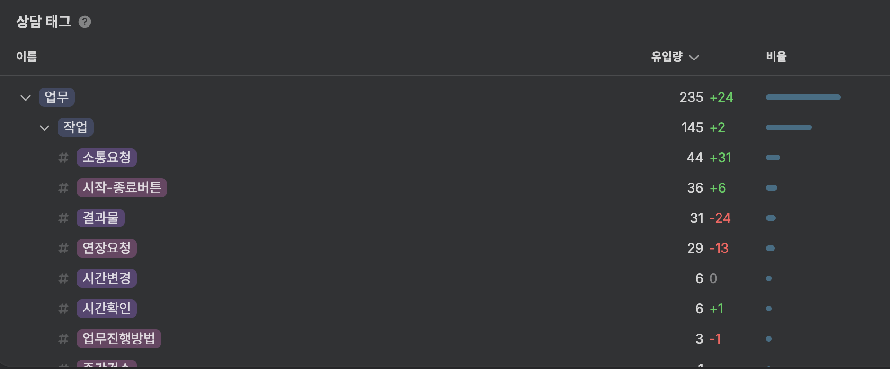
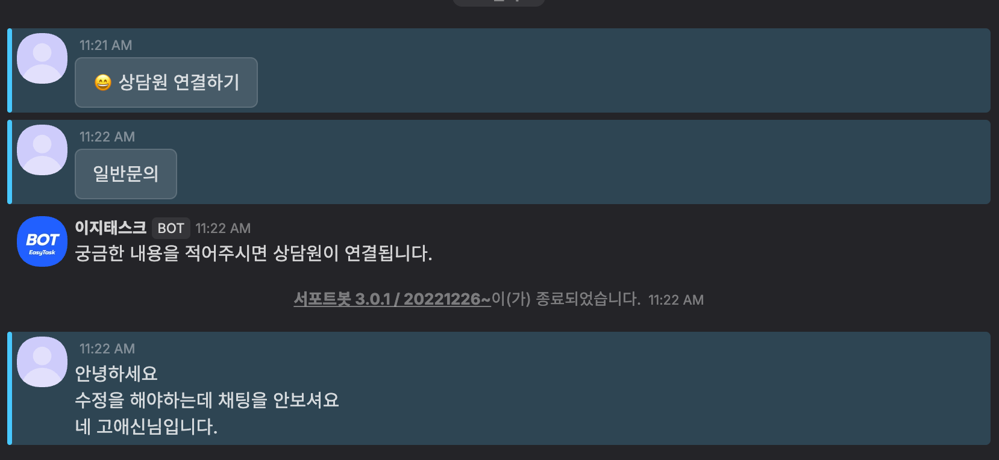
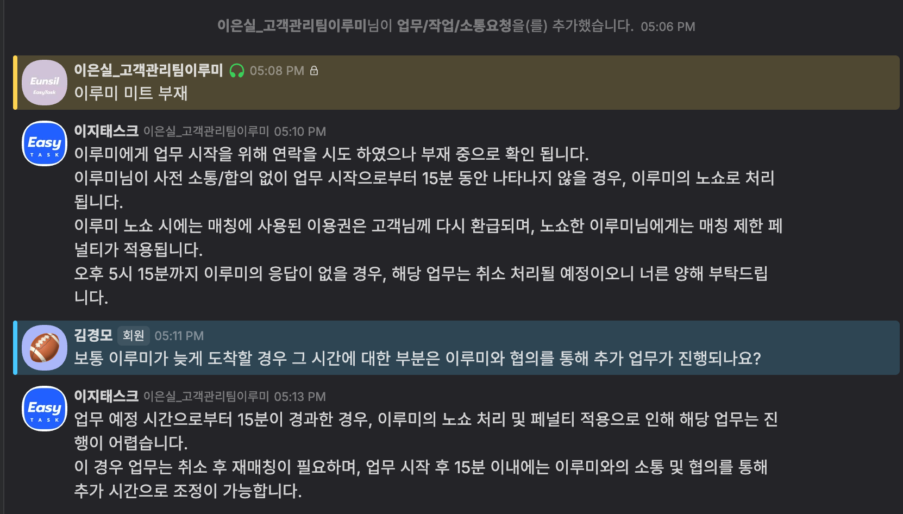
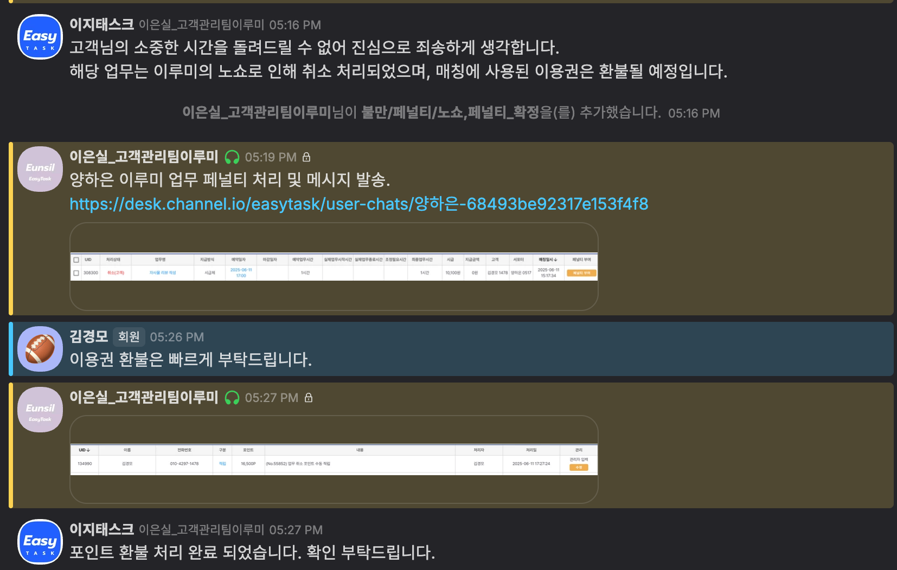
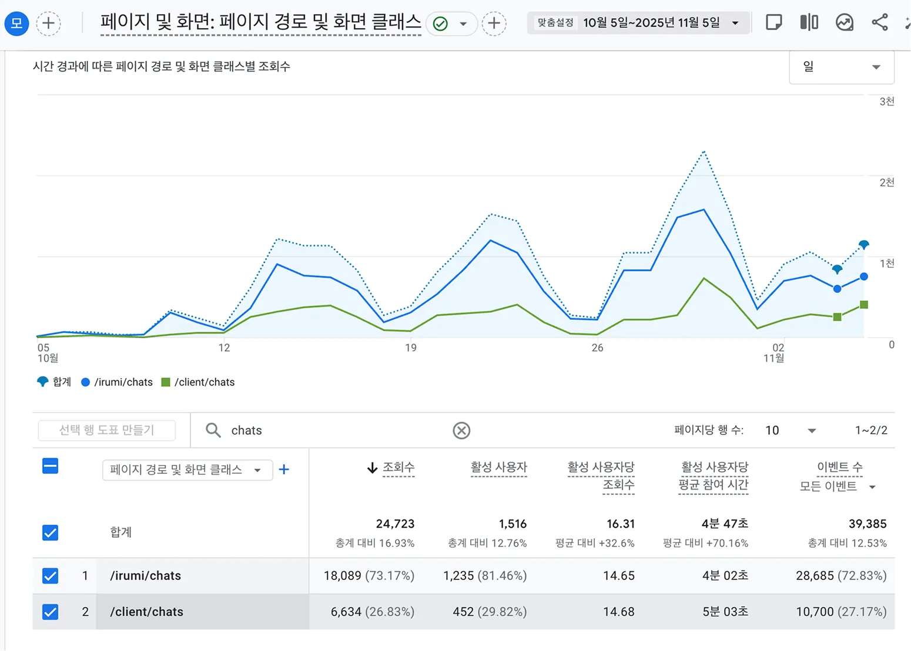
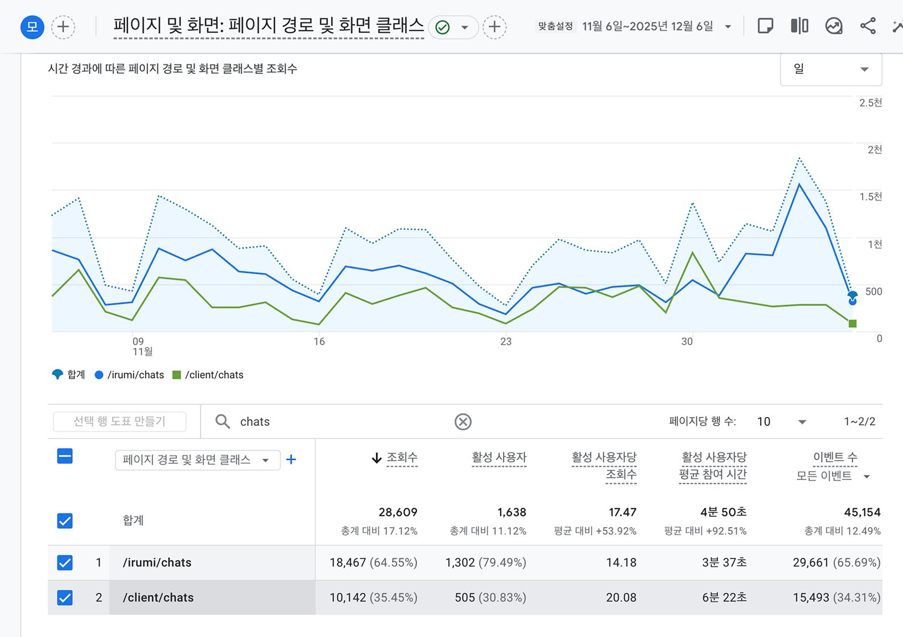

# 채팅 기반 업무 관리 경험 개선

채팅 화면을 ‘업무 수행 허브’로 재설계하여 주요 기능 접근성과 업무 관리 효율을 개선하고, 기능 탐색 및 소통 지연으로 발생하는 고객 CS를 감소시키는 것을 목표로 했습니다. 개선 이후 사용자당 채팅 조회수(+36.8%), 이벤트(+29.6%), 체류시간(+26.1%)이 증가하며 채팅 내 업무 관리 기능 활용도가 높아졌습니다. 또한 고객의 업무 관련 CS는 21.4% 감소하여 일부 기능 접근성과 사용성이 개선된 것을 확인했습니다.

## 1. 백그라운드

고객은 업무 요청서를 통해 이루미와 매칭된 후, 서비스 내 채팅 기능을 중심으로 업무를 진행하고 관리하는 구조였습니다.

그러나 업무 시간 연장, 결과물 확인 등 핵심 업무 관리 기능이 채팅 화면이 아닌 ‘업무 요청서 상세페이지’에 위치해 있어, 고객은 업무 수행 중 필요한 기능을 사용하기 위해 다른 화면으로 이동해야 했습니다. 이로 인해 기능 탐색에 어려움을 겪는 상황이 반복되었고, 관련 VOC가 지속적으로 발생했습니다.

또한 실시간 소통이 중요한 서비스 특성상, 이루미의 응답이 지연되는 경우 이를 확인하거나 대응할 수 있는 수단이 부족해 소통 지연 관련 VOC 역시 반복적으로 발생했습니다.

이러한 문제를 해결하기 위해 채팅 화면을 단순 메시지 확인 용도가 아닌, 업무 수행과 관리 중심 인터페이스로 재설계했습니다.

### 1-1. 상담 태그

> 채널톡 / 2025.05.29~06.27 (1개월)
>
- 상담 태그 상세
  - 결과물 : 작업한 결과물 제출 여부 또는 제출에 대한 리마인드로 요청하는 건
  - 연장요청 : 작업 도중 업무 시간을 요청하는 건
  - 소통요청 : 작업 진행 중, 채팅방 소통이 잘 이루어 지지 않아, 리마인드 요청을 하는 건
  - 시간변경 : 매칭완료 후, 작업시간 도래 전 매칭시간 변경을 요청하는 건
  - 업무진행방법 : 구체적인 업무 진행 방법 문의, 업무 상세 내용 ex. 요구사항을 정확히 이해 못함 등
  - 시간확인 : 해당 업무 건의 실제 업무 시간 확인을 요청하는 건
  - 시작-종료버튼 : 시작 종료버튼을 누르지 못하여 연락이 온 건

1. **소통요청** 44 (30.34%)
2. **시작-종료버튼** 36 (24.83%)
3. **결과물** 31 (21.38%)
4. **연장요청** 29 (20%)
5. **시간변경** 6 (4.14%)
6. **시간확인** 6 (4.14%)
7. **업무진행방법** 3 (2.07%)
8. **중간검수** 1 (0.69%)

### 1-2. 주요 고객 문의 유형

- (이루미)응답 지연 시 대응 방법 문의 및 환불요청
  - (소통요청) 실제 고객 VOC
  
  
  
  

- 결과물 확인 경로 문의
- 업무 시간 연장 방법 문의

### 1-3. 채팅 화면의 역할 한계 도출

- 기존 역할 : 메시지 확인
- 필요 역할 : 업무 관리 및 실시간 소통

---

## 2. 문제 정의

1. 기능 분산으로 인한 업무 흐름 단절
  1. 업무 연장, 결과 확인 기능이 업무요청상세 페이지에 위치
  2. 채팅 중 기능 실행을 위해 화면 이동 필요
2. 소통 지연 대응 기능 부재
  1. 업무 수행 이루미의 응답 지연 시 대응 수단 없음
  2. 업무 관련 고객 문의 중 30.3%가 소통 관련 문의로 나타났으며, 일부 환불 요청으로도 이어지고 있음

---

## 3. 가설

### 가설 1. 채팅 화면 내 업무 관리 기능 부재

[문제]

기존 채팅 화면은 메시지 확인 중심 구조로 설계되어 있었고, 업무 수행에 필요한 주요 관리 기능이 다른 화면에 분산되어 있었습니다.

[가설]

만약 채팅 화면에서 업무 연장, 결과 확인 등 주요 관리 기능을 직접 수행할 수 있도록 한다면, 사용자는 기능을 찾기 위해 다른 화면으로 이동할 필요가 줄어들고 채팅 화면 내 기능 활용도가 증가할 것이며 기능 탐색 과정에서 발생하던 고객센터 문의도 감소할 것이다.

### 가설 2. 소통 지연 대응 기능 부재

[문제]

업무를 요청한 고객은 이루미의 채팅 응답이 지연되는 상황에서 이를 해결할 수 있는 수단이 없어 소통에 불편함을 겪고 있으며, 이로 인해 CS 문의가 발생하고 있습니다.

[가설]

만약 고객이 채팅 확인 요청 알림을 보낼 수 있는 기능을 제공한다면, 이루미는 채팅 확인이 필요함을 빠르게 인지하고 응답할 수 있으며 소통 요청 관련 VOC가 감소할 것이다.

---

## 4. 솔루션

- **AS-IS**  메시지 중심
- **TO-BE** 업무 관리 및 실시간 소통 중심 인터페이스

개선 결과 :

- 기능 탐색을 위한 화면 이동 제거, 업무 관련 모든 주요 액션을 단일 화면에서 수행 가능
- 고객에게는 '통제권(확인 요청 기능)'을, 작업자에게는 '명확한 트리거(알림)'를 제공하는 [채팅 확인 요청] 기능을 설계. 심리적 불안감을 제품 내부 기능으로 해소하도록 유도

---

## 5. 데이터

> Nov 6, 2025 1:00pm KST (25년 11월 6일 배포)
>

### 5-1. 고객 행동 데이터 (GA4)

- 지표 의미
  - 조회수 (=페이지 사용량)
    - 해당 페이지가 총 몇 번 열렸는지
    - 같은 사용자가 여러 번 들어오면 모두 카운트
  - 활성 사용자 (=사용자 규모)
    - 해당 기간 동안 페이지를 방문한 고유 사용자 수
    - 같은 사용자가 여러 번 들어와도 1명으로 계산
  - 활성 사용자당 조회수 (=사용 빈도)
    - 사용자 1명이 평균적으로 몇 번 페이지를 봤는지
  - 활성 사용자당 평균 참여 시간 (=몰입도)
    - 사용자 1명이 해당 페이지에서 실제로 활동한 평균 시간
  - 이벤트 수 (=상호작용)
    - 해당 페이지에서 발생한 모든 사용자 행동 이벤트
    - 버튼클릭, 파일업로드, 스크롤, 화면이동 등

[ASIS] 10월5일~11월 5일 (30일)

- 전체 서비스 활성 사용자 : 11,877
- 채팅 조회수 : 6,634
- 채팅 활성 사용자 : 452
- 활성 사용자당 조회수 : 14.68
- 활성 사용자당 평균 참여 시간 : 5분 03초
- 이벤트 수 모든 이벤트 : 10,700

[TOBE] 11월6일~ 12월6일 (30일)

- 전체 서비스 활성 사용자 : 14,724
- 채팅 조회수 : 10,142
- 채팅 활성 사용자 : 505
- 활성 사용자당 조회수 : 20.08
- 활성 사용자당 평균 참여 시간 : 6분 22초
- 이벤트 수 모든 이벤트 : 15,493

### 5-1-1. 분석

- 증가율 계산
  1. 사용자 규모 변화 (고객+이루미)
    - 11,877 → 14,724
    - 증가율 (14,724−11,877)/11,877 = **+23.96%**
  2. 채팅 활성 사용자 (고객)
    - 452 → 505
    - 증가율 (505−452)/452 = **+11.7%**
  3. 활성 사용자당 조회수 (고객)
    - 14.68 → 20.08
    - 증가율 (20.08−14.68)/14.68 = **+36.8%**
  4. 활성 사용자당 이벤트 (고객)
    - ASIS 10,700 ÷ 452 = **23.67**
    - TOBE 15,493 ÷ 505 = **30.68**
    - 증가율 (30.68−23.67)/23.67 = **+29.6%**
  5. 활성 사용자당 참여시간 (고객)
    - 5분 03초 = **303초**
    - 6분 22초 = **382초**
    - 증가율 (382−303)/303 = **+26.1%**
- 전체 서비스 활성 사용자는 약 24% 증가했지만, 채팅 활성 사용자 증가율은 11.7%로 상대적으로 낮다.
- 채팅 사용자 수의 큰 변화는 없었지만 채팅을 사용하는 사용자들의 행동 밀도는 증가했다.
- 사용자 행동 변화
  1. 채팅을 사용하는 사용자의 기능 접근 빈도 증가
    1. 활성 사용자당 조회수 14.68 → 20.08 (+36.8%)
    2. → 채팅을 사용하는 사용자들은 채팅 화면에 더 자주 접근하며 기능을 반복적으로 확인하는 행동이 증가했습니다.
  2. 채팅 화면 내 상호작용 증가
    1. 활성 사용자당 이벤트 23.67 → 30.68 (+29.6%)
    2. → 채팅 화면에서 **업무 관련 기능 사용 및 상호작용이 전반적으로 증가**했습니다.
  3. 채팅 화면 내 체류 및 업무 관리 활동 증가
    1. 활성 사용자당 참여 시간 5분 03초 → 6분 22초 (+26.1%)
    2. → 채팅 화면에서 **업무 관리 및 소통 활동에 더 많은 시간을 사용한 것으로 확인되었습니다.**

→ 채팅 사용자 수의 큰 증가 없이도 사용자당 채팅 조회수와 상호작용이 증가한 것으로 나타났습니다. 이는 채팅 화면을 업무 수행 중심 구조로 개선하면서 사용자가 채팅 내에서 업무 관리 기능을 보다 적극적으로 활용하게 되었음을 시사합니다.

### 5-2. 기능 관련 CS 변화

> 채널톡, 배포 전후 기간 + 고객 태그만 필터링
>

[ASIS] 10월5일~11월 5일 (30일)

- 고객 전체 상담 : 193건
- 업무 > 작업 태그 상담 : 98건
  - 결과물 : 33
  - 연장요청 : 48
  - 소통요청 : 14
  - 시간변경 : 7
  - 업무진행방법 : 4
  - 시간확인 : 0
  - 시작-종료버튼 : 2

[TOBE] 11월6일~ 12월6일 (30일)

- 고객 전체 상담 : 290건
- 업무 > 작업 태그 상담 : 77건
  - 결과물 : 33
  - 연장요청 : 26
  - 소통요청 : 20
  - 시간변경 : 2
  - 업무진행방법 : 2
  - 시간확인 : 1
  - 시작-종료버튼 : 1

### 5-2-1. 분석

1. **전체 CS 변화**

   → 전체 상담은 50% 증가했지만, 채팅 기능과 직접적으로 관련된 업무 > 작업 관련 문의 비중이 절반 수준으로 감소

   | 항목 | ASIS | TOBE | 변화 |
       | --- | --- | --- | --- |
   | 고객 전체 상담 | 193 | 290 | **+97 (+50.3%)** |
   | 업무 > 작업 태그 상담 | 98 | 77 | **-21 (-21.4%)** |
2. **세부 CS 변화**

   → 연장 요청 문의 감소하였으나, 그외 소통요청, 결과물 확인 경로 문의 수는 증가

   | 항목 | ASIS | TOBE | 변화 |
       | --- | --- | --- | --- |
   | 결과물 | 33 | 33 | 동일 |
   | 연장요청 | 48 | 26 | **-22 (-45.8%)** |
   | 소통요청 | 14 | 20 | **+6 (+42.9%)** |
   | 시간변경 | 7 | 2 | **-5 (-71.4%)** |
   | 업무진행방법 | 4 | 2 | **-2 (-50%)** |
   | 시간확인 | 0 | 1 | +1 |
   | 시작/종료 버튼 | 2 | 1 | -1 |

### 5-3. 보완

1. 분석 : 최근 신규로 개발·배포한 ‘채팅 확인 요청’ 버튼의 클릭 수가 예상보다 낮았으며, 이에 따라 소통 관련 VOC(문의) 수도 유의미하게 감소하지 않은 것으로 확인된다.
2. 가설 : 고객이 해당 버튼의 존재는 인식하더라도 어떤 상황에 눌러야 하며, 누르면 어떤 일이 발생하는지를 이해하지 못해 클릭으로 이어지지 않는 상황일 것이다.
3. 해결 : 툴팁(Tooltip) 또는 버튼 주변 설명 문구를 추가하여 버튼의 기능(“이루미에게 채팅 확인을 요청합니다”)을 직관적으로 안내할 필요가 있다.
4. 데이터
  1. [ASIS] 10월5일~11월 5일 (30일)
    1. 고객 전체 문의 : 193건
    2. 고객 업무 > 작업 문의 : 98건
    3. 고객 소통요청 문의 건 : 14건
  2. [ASIS] 11월6일~ 12월6일 (30일)
    1. 고객 전체 문의 : 290건
    2. 고객 업무 > 작업 문의 : 77건
    3. 고객 소통요청 문의 건 : 20건
  3. [TOBE] 12월 7일 ~ 26년 1월 7일 (30일)
    1. 고객 전체 문의 : 165건
    2. 고객 업무 > 작업 문의 : 77건
    3. 고객 소통요청 문의 건 : 13건
  4. [TOBE] 1월 8일 ~ 2월 8일 (30일)
    1. 고객 전체 문의 : 145건
    2. 고객 > 작업 문의 : 68건
    3. 고객 소통요청 문의 건 : 9건
5. 결과
  1. 채팅 기능 개선 이후 작업 문의는 감소했으나, 소통 요청 문의 비율은 약 7% 수준으로 큰 변화가 없었습니다. 이는 UI 개선만으로는 이루미 응답 지연과 같은 소통 문제를 완전히 해결하기 어렵다는 점을 보여줍니다.

## 6. 결과

### 6-1. 고객의 채팅 기능 사용성

채팅 사용자 수의 큰 증가 없이도 사용자 행동 지표는 전반적으로 증가했습니다.

- 사용자당 채팅 조회수 +36.8%
- 사용자당 이벤트 +29.6%
- 사용자당 평균 체류시간 +26.1%

이는 채팅 화면을 업무 수행 중심 구조로 개선하면서 사용자가 채팅 내에서 업무 관리 기능을 보다 적극적으로 활용하게 되었음을 의미합니다.

특히 채팅 화면 내 기능 접근 빈도와 상호작용이 증가하며 채팅이 단순 메시지 기능을 넘어 업무 진행과 관리가 이루어지는 핵심 인터페이스로 활용되고 있음을 확인할 수 있습니다.

### 6-2. 고객 업무 관련 CS 변화

채팅은 고객의 업무 소통과 관리가 진행되는 주요 공간으로, 채팅 화면 내 기능과 연관된 ‘업무 > 작업’ 태그 VOC를 중심으로 변화를 분석했습니다.

- 전체 고객 상담 : +50.3% 증가
- 업무 > 작업 문의 : 21.4% 감소

즉 전체 문의는 증가했지만 채팅 기능과 직접적으로 연관된 업무 문의는 감소한 것으로 나타났습니다.

- 업무 시간 연장 문의 -45.8% 감소

업무 관리 기능 탐색과 관련된 문의가 감소했습니다. 이는 채팅 화면 개선을 통해 업무 관리 기능의 접근성과 가시성이 개선된 결과로 해석됩니다.

그러나 일부 영역에서는 VOC 감소 효과가 제한적으로 나타났습니다.

- 결과물 확인 문의 : 변화 없음
- 소통 요청 문의 : +42.9% 증가

이는 채팅 UI 개선만으로는 이루미 응답 지연과 같은 소통 문제를 완전히 해결하기 어렵다는 점을 보여주며, 향후 응답 지연 상황에 대응할 수 있는 기능 설계가 추가적으로 필요함을 시사합니다.
